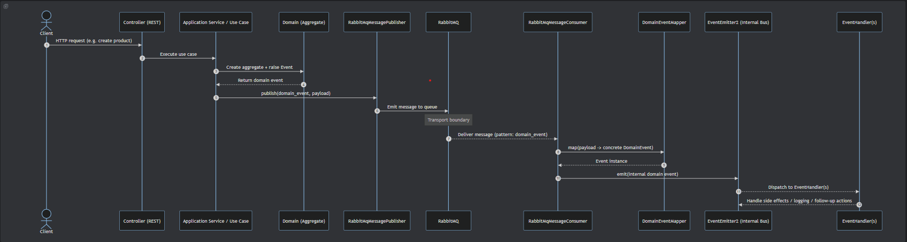

# Hexagonal DDD Practice Project (NestJS + TypeScript)


| CI Status                                                                                                                                                                                               | License                                                                                                                                                                                                          |
|---------------------------------------------------------------------------------------------------------------------------------------------------------------------------------------------------------|------------------------------------------------------------------------------------------------------------------------------------------------------------------------------------------------------------------|
| [](https://github.com/hirannor/hexagonal-ddd-nestjs/actions/workflows/ci.yml) | [](https://opensource.org/licenses/MIT) [](https://commonsclause.com/) |

This repository is a **practice/example project** for applying:

- **Hexagonal Architecture (Ports & Adapters)**
- **DDD (Domain-Driven Design) principles**
- **NestJS + TypeScript** ecosystem

The goal is to keep the **domain and application logic independent** from technical details (web, database, framework-specific infrastructure), while wiring concrete adapters through dependency injection.

## Tech Stack

- **NestJS**
- **TypeScript**
- **TypeORM** (for persistence adapter)
- **PostgreSQL** (when TypeORM adapter is selected)
- **RabbitMQ** (messaging adapter for domain-event transport)
- **EventEmitter2** (internal domain/application event handling)

## Architecture Overview

- `src/domain`  
  Core domain model, domain events, value objects, and repository contracts (ports).

- `src/application`  
  Use cases and application services orchestrating domain behavior.

- `src/adapter`  
  External adapters:
    - web/rest controllers
    - persistence adapters (`typeorm`, `inmemory`)
    - messaging adapter (`rabbitmq`) for transport-level publish/consume

- `src/infrastructure`  
  Shared technical abstractions and framework-facing contracts.

## Messaging Architecture

### Domain Event Flow



## Getting Started

Use these steps to run the project locally with the expected environment file and Docker services.

### 1) Prerequisites

- Node.js (LTS recommended)
- npm
- Docker + Docker Compose

### 2) Install dependencies

```bash
npm install
```

### 3) Configure environment variables

The application reads environment variables from `.env.<NODE_ENV>` (see `src/app.module.ts`).
If `NODE_ENV` is not set, it defaults to `development`, so `.env.development` is expected.

Use `.env.example` as the template and rename/copy it:

```powershell
Copy-Item .env.example .env.development
```

Then update values in `.env.development` (for example `RABBITMQ_URL`, `RABBITMQ_QUEUE`, and database settings) to match your local setup.

### 4) Start infrastructure (Docker Compose)

The `docker-compose.yaml` file starts local infrastructure services used by the app.

```powershell
docker compose up -d
```

To stop and remove the containers:

```powershell
docker compose down
```

### 5) Start the application

```bash
npm run start:dev
```

### Notes

- To use another environment, set `NODE_ENV` and create the matching `.env.<NODE_ENV>` file.
- If startup fails due to connection errors, verify Docker containers are running and values in `.env.development` match exposed ports/credentials from `docker-compose.yaml`.
