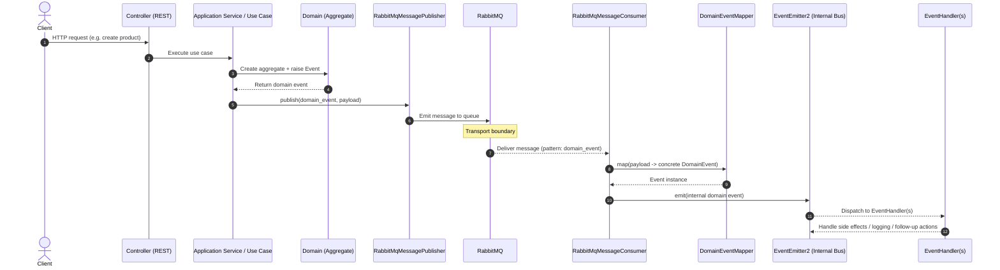

```mermaid
sequenceDiagram
   autonumber
   actor Client
   participant REST as Controller (REST)
   participant App as Application Service / Use Case
   participant Domain as Domain (Aggregate)
   participant Publisher as RabbitMqMessagePublisher
   participant RMQ as RabbitMQ
   participant Consumer as RabbitMqMessageConsumer
   participant Mapper as DomainEventMapper
   participant Emitter as EventEmitter2 (Internal Bus)
   participant Handler as EventHandler(s)

   Client->>REST: HTTP request (e.g. create product)
   REST->>App: Execute use case
   App->>Domain: Create aggregate + raise Event
   Domain-->>App: Return domain event
   App->>Publisher: publish(domain_event, payload)

   Publisher->>RMQ: Emit message to queue
   Note over RMQ: Transport boundary

   RMQ-->>Consumer: Deliver message (pattern: domain_event)
   Consumer->>Mapper: map(payload -> concrete DomainEvent)
   Mapper-->>Consumer: Event instance
   Consumer->>Emitter: emit(internal domain event)
   Emitter-->>Handler: Dispatch to EventHandler(s)
   Handler-->>Emitter: Handle side effects / logging / follow-up actions
```